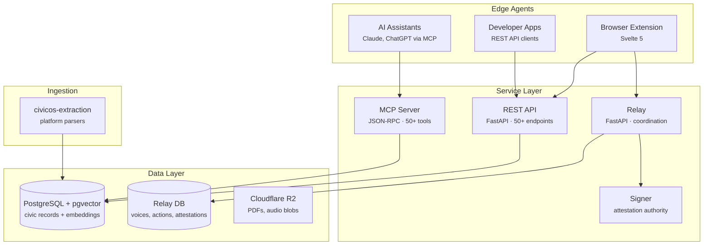

# Architecture Overview

CivicOS is a three-layer system: civic data, a coordination relay, and edge agents (browser extension, AI assistants). Each layer is independently deployable and operated.

## The Three Layers

### Layer 1: Civic Data

Structured public records — meetings, decisions, legislation, budgets, transcripts, community issues, municipal code. All data is public record, extracted from government platforms by the [ingestion pipeline](data-ingestion.md).

- **Storage:** PostgreSQL with pgvector (Supabase)
- **Semantic search:** ~16,800 vector embeddings for natural language queries
- **Access:** REST API, MCP server, or Python SDK (`civicos` package)

### Layer 2: Coordination Relay

Bidirectional civic participation infrastructure. Stores signed Nostr events — voices (support/oppose), civic actions, subscriptions, attestations. All writes require cryptographic signatures; most require [attestation](relay/attestation.md).

- **Storage:** Separate PostgreSQL database (deliberate architectural boundary)
- **Protocol:** Nostr-compatible (secp256k1 Schnorr signatures, BIP-340)
- **Federation:** Operators can peer relays to sync voices across jurisdictions
- **AI Proxy:** Privacy-preserving AI access for attested residents

### Layer 3: Edge Agents

Clients that consume civic data and interact with the relay:

- **Browser extension** — primary resident interface (Chrome, Svelte 5)
- **MCP server** — AI assistants query civic data through 50+ read-only tools
- **REST API** — developers build custom integrations
- **Signer** — organizations run their own attestation authority

## Key Architectural Decisions

| Decision | Choice | Why |
|----------|--------|-----|
| Separate MCP + relay databases | Two PostgreSQL instances | Civic data (public record) has different trust/federation boundaries than coordination data (who voiced what) |
| Nostr protocol for coordination | secp256k1 Schnorr signatures | Self-verifying events — any relay can validate a voice without contacting the original relay |
| Config-driven ingestion | YAML per jurisdiction | Adding a new city is configuration, not code — see [data ingestion](data-ingestion.md) |
| pgvector over hosted vector DB | PostgreSQL extension | Same infrastructure, no additional service to operate |
| Local-first identity | Keys generated in browser | Private keys never leave the device |

For the full rationale behind these decisions, see [Architecture Decision Records](decisions/vector_storage.md) and the [deep dive series](learning/README.md).

## Package Map

| Package | Layer | Purpose |
|---------|-------|---------|
| [`civicos`](packages/civicos.md) | Data | Core query API |
| [`civicos-services`](packages/civicos-services.md) | Services | REST API server |
| [`civicos-relay`](packages/civicos-relay.md) | Relay | Coordination infrastructure |
| [`civicos-signer`](packages/civicos-signer.md) | Relay | Attestation signing service |
| [`civicos-extraction`](packages/civicos-extraction.md) | Ingestion | Platform parsers |
| [`civicos-client`](packages/civicos-client.md) | Edge | TypeScript client library |
| [`civicos-components`](packages/civicos-components.md) | Edge | Svelte UI components |

## Deployment

All services run on [Modal](https://modal.com) (serverless Python). Data lives in Supabase PostgreSQL. Blobs in Cloudflare R2. See the [operator guide](operator-guide.md) for deployment instructions.
